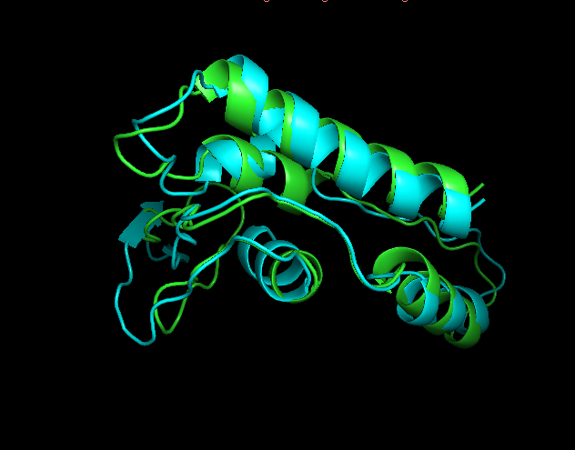

### 1

seq: `MVEYFGQNLNGFLFTKNAWVQSYGTRCVKPPIVWGDVSRANPITVEWSAYAQSKTDHVMKGMLTGPVTILNWSWPREDITHEEQTKQLALAIRDEVLDLE`

`omegafold & alfafold2` + `MMLigner`

### 2

`AlphaFold2.ipynb`, `omegafold.ipynb`

### 3 Predictions

omegafold\_test\_0cbef.pdb && ./alfafold\_test\_0cbef.result/\*.pdb

From ./alfafold results, rank\_1\_model\_5.pdb was used.

### 4

test\_0cbef\_unrelaxed\_rank\_1\_model\_5.pdb\_superposed\_\_1.pdb

omegafold\_test\_0cbef.pdb\_vs\_test\_0cbef\_unrelaxed\_rank\_1\_model\_5.pdb\_\_1.stats

omegafold\_test\_0cbef.pdb\_vs\_test\_0cbef\_unrelaxed\_rank\_1\_model\_5.pdb\_\_1.afasta

### 5

pymol\_session.pse

### 6

### 7

Полученные предсказания имеют общие части, но все же довольно сильно отличаются.

